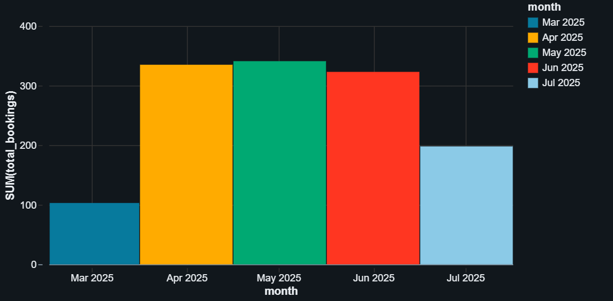
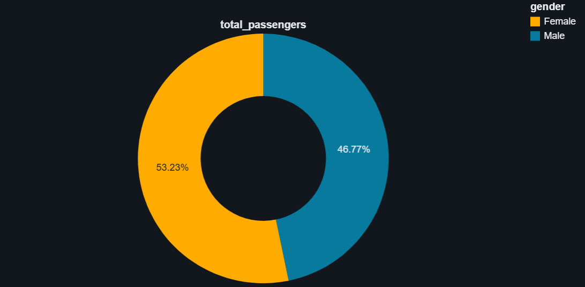
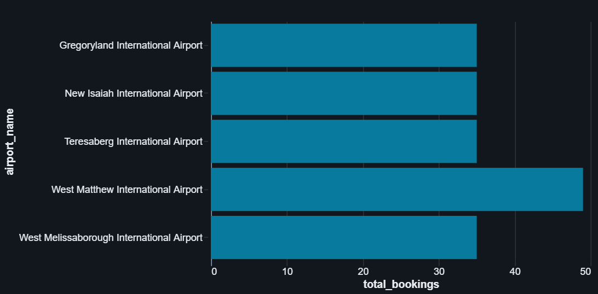
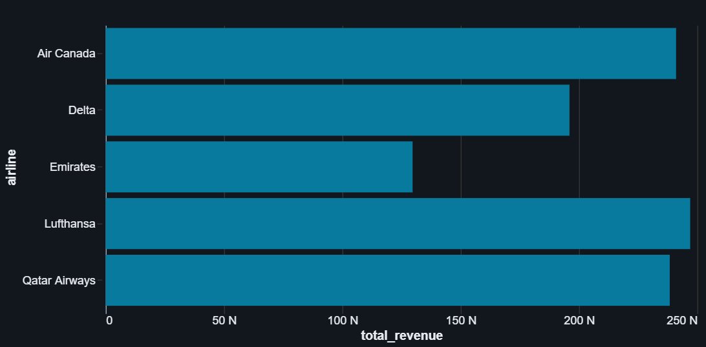

# Databricks ETL Pipeline – Flight Booking Data

## Introduction
This repository contains an **end-to-end ETL pipeline** built and practiced on **Databricks** (platform) to learn Cloud Data Engineering concepts.  
The pipeline processes airline booking data and follows the **Medallion Architecture** (kiến trúc Medallion: Bronze → Silver → Gold).  
Key learning goals: working with incremental ingestion, data quality checks, Delta Live Tables (DLT) (Delta Live Tables), and dimensional modeling.

**Highlights**
- Ingest CSV inputs via Auto Loader (cloudFiles) (Auto Loader).  
- Bronze: raw landing (Delta tables).  
- Silver: transformations + data quality + SCD (Slowly Changing Dimension).  
- Gold: star schema (fact & dimensions) for analytics.
- Orchestration via Databricks Job (Jobs) and Delta Live Tables pipeline.

---

## Architecture (Medallion)
Raw CSV → Bronze (Landing) → Silver (Transform/Clean) → Gold (Analytics)

```yaml
- Bronze: raw ingest, minimal transformation, store as Delta tables (Delta Lake).  
- Silver: cleaning, type coercion, quality rules, apply SCD where needed.
- Gold: business-ready tables (fact & dimensions), analytical queries.
```

---

## Repository layout (recommended)
```
databricks-etl-pipeline/
├── notebooks/
│   ├── bronze/
│   │   ├── BronzeLayer.py      # ingestion logic (Auto Loader)
│   │   └── SrcParameters.py    # source list for ingestion
│   ├── silver/
│   │   └── dltPipeline.py      # DLT pipeline code (silver layer)
│   └── gold/
│       └── GoldLayer.py        # gold build scripts / notebooks
├── configs/
│   ├── bronze_ingestion_job.json    # Job JSON export (Bronze_Ingestion)
│   └── silver_dlt_pipeline.json     # Pipeline JSON export (SILVER_DLT_PIPELINE)
├── queries/
│   ├── monthly_bookings_trend.sql
│   ├── revenue_by_route.sql
│   └── passenger_demographics.sql
├── images/
│   ├── input_data.png
│   ├── erd.png
│   ├── monthly_bookings_trend.png
│   ├── passenger_demographics.png
│   ├── top_airports_bookings.png
│   └── revenue_by_airline.png
├── models/
│   └── star_schema.dbml
├── README.md
└── LICENSE
```

---

## Input Data Overview

This project uses **mock flight booking data** to simulate a realistic airline reservation system. The dataset consists of dimension tables and a fact table, designed to demonstrate incremental data ingestion and SCD handling.

### Data Files Structure

| File Name | Records | Description | Key Columns |
|-----------|---------|-------------|-------------|
| `dim_airports.csv` | 50 | Base airport dimension | `airport_id`, `airport_name`, `city`, `country` |
| `dim_airports_increment.csv` | 5 | Incremental airport updates | Same schema as base |
| `dim_flights.csv` | 100 | Base flight dimension | `flight_id`, `airline`, `origin`, `destination`, `flight_date` |
| `dim_flights_increment.csv` | 10 | Incremental flight updates | Same schema as base |
| `dim_passengers.csv` | 200 | Base passenger dimension | `passenger_id`, `name`, `gender`, `nationality` |
| `dim_passengers_increment.csv` | 20 | Incremental passenger updates | Same schema as base |
| `fact_bookings.csv` | 1,000 | Base booking fact table | `booking_id`, `passenger_id`, `flight_id`, `airport_id`, `amount`, `booking_date` |
| `fact_bookings_increment.csv` | 300 | Incremental booking records | Same schema as base |

### Sample Data Preview

**dim_airports.csv** (first 5 rows):
```csv
airport_id,airport_name,city,country
A001,Gregoryland International Airport,Kristenmouth,South Georgia and the South Sandwich Islands
A002,East Kristin International Airport,North Michaelview,Bosnia and Herzegovina
A003,Brownland International Airport,Samuelville,Costa Rica
A004,Meghanton International Airport,Andrewsmouth,Macedonia
A005,East Aaron International Airport,Davishaven,Monaco
```

**dim_flights.csv** (first 5 rows):
```csv
flight_id,airline,origin,destination,flight_date
F0001,Delta,Kellyfort,South Kathleen,2025-05-04
F0002,Qatar Airways,Lake Stephen,New Vincent,2025-04-29
F0003,Lufthansa,East Patrickborough,North Mary,2025-05-11
F0004,Delta,Maddenshire,Johnchester,2025-05-16
F0005,Qatar Airways,Bennettside,New Mistyhaven,2025-06-13
```

**dim_passengers.csv** (first 5 rows):
```csv
passenger_id,name,gender,nationality
P0001,Kevin Ferguson,Male,Reunion
P0002,Kathleen Martinez DVM,Female,Burkina Faso
P0003,Cynthia Frazier,Male,Marshall Islands
P0004,Ryan Ramsey,Male,Niger
P0005,Mike Kim,Male,Taiwan
```

**fact_bookings.csv** (first 4 rows):
```csv
booking_id,passenger_id,flight_id,airport_id,amount,booking_date
B00001,P0048,F0014,A048,850.72,2025-05-29
B00002,P0011,F0052,A003,376.63,2025-06-09
B00003,P0079,F0023,A012,534.02,2025-06-03
B00004,P0068,F0001,A039,1333.7,2025-06-16
```

### Data Characteristics
- **Time Range**: Bookings span from March 2025 to July 2025
- **Airlines**: Delta, Qatar Airways, Lufthansa, Emirates, Air Canada
- **Booking Amounts**: Range from ~$300 to ~$1,500 per booking
- **Data Type**: Synthetic/mock data generated for learning purposes
- **Incremental Updates**: Simulate new bookings and dimension changes arriving in batches

---

## Bronze Layer

### Implementation summary
- Ingest method: **Auto Loader / cloudFiles** (Auto Loader — dịch vụ đọc incremental file mới).  
- Bronze notebook: `notebooks/bronze/BronzeLayer.py`. It uses `dbutils.widgets` to iterate sources and Spark Structured Streaming with `cloudFiles` to append each source to a Delta path under:
  - `/Volumes/workspace/bronze/bronzevolume/<source>/data` (checkpoint at `/Volumes/.../<source>/checkpoint`).

**Bronze orchestration**
- Job file: `configs/bronze_ingestion_job.json`. This Job contains two main tasks:
  1. `Parameter` task (populate `src_array` with source names).
  2. `Incremental_Ingestion` task (for-each over `src_array`, run the Bronze notebook with `src` parameter).
- You can import that JSON in Databricks Workflows (Jobs) UI or use Databricks CLI to create the job.

---

## Silver Layer 

### Goals
- Clean & coerce types, add `modifiedDate` column for CDC sequencing.  
- Enforce quality rules (drop invalid records).  
- Implement SCD Type 1 (overwrite when key matches) using Databricks DLT helpers.  
- Provide a `silver_business` view/table that joins the cleaned silver tables.

### Code (key files)
- `notebooks/silver/dltPipeline.py` — this file is the DLT pipeline source and is already in the repo.

**Key excerpts & behavior**
- `@dlt.table(name="stage_bookings")` reads Bronze delta for bookings:

```python
@dlt.table(name="stage_bookings")
def stage_bookings():
    return spark.readStream.format("delta")\
        .load("/Volumes/workspace/bronze/bronzevolume/bookings/data")
```

- `trans_bookings` view: cast amount to double, convert booking dates, add modifiedDate:

```python
@dlt.view(name="trans_bookings")
def trans_bookings():
    return (spark.readStream.table("stage_bookings")
            .withColumn("amount", col("amount").cast(DoubleType()))
            .withColumn("booking_date", to_date(col("booking_date")))
            .withColumn("modifiedDate", current_timestamp())
            .drop("_rescued_data"))
```

- Data quality rule example:

```python
rules = {
    "rule1": "booking_id IS NOT NULL",
    "rule2": "passenger_id IS NOT NULL"
}

@dlt.table(name="silver_bookings")
@dlt.expect_all_or_drop(rules)
def silver_bookings():
    return spark.readStream.table("trans_bookings")
```

For flights / passengers / airports the pipeline uses `dlt.create_auto_cdc_flow(... stored_as_scd_type=1)` to perform SCD Type 1 behavior keyed by flight_id, passenger_id, airport_id.

A joined business table/view `silver_business` is defined:

```python
@dlt.table(name="silver_business")
def silver_business_view():
    df = dlt.readStream("silver_bookings")\
            .join(dlt.readStream("silver_passengers"), ["passenger_id"])\
            .join(dlt.readStream("silver_flights"), ["flight_id"])\
            .join(dlt.readStream("silver_airports"), ["airport_id"])\
            .drop("modifiedDate")
    return df
```

### Pipeline config
`configs/silver_dlt_pipeline.json` — exported pipeline JSON (contains libraries globs pointing to the repo DLT file).

**Note:** If you import this JSON into another Databricks workspace, verify `root_path` and `libraries` include paths match the repository mounting path in that workspace (e.g., `/Repos/<your-email>/databricks-etl-pipeline/dltPipeline.py`).

---

## Gold Layer

### Goal
Build a minimal star schema (fact + dimensions) from Silver data and create analytic-ready tables.

### Star schema (ERD)
`images/erd.png` contains the diagram for these tables:

- `dim_passengers(passenger_sk, passenger_id, name, gender, nationality)`
- `dim_flights(flight_sk, flight_id, airline, origin, destination, flight_date)`
- `dim_airports(airport_sk, airport_id, airport_name, city, country)`
- `fact_bookings(booking_id, passenger_sk, flight_sk, airport_sk, amount, booking_date)`

(Use surrogate key (khóa thay thế) such as deterministic hash (`sha2(...)`) or `monotonically_increasing_id()` for small sample data.)

### Example Python (PySpark) to create gold tables

Create gold schema / database:
```sql
%sql
CREATE DATABASE IF NOT EXISTS gold
LOCATION '/Volumes/workspace/goldvolume';
USE gold;
```

Example dimension create (deterministic hash surrogate keys recommended):
```python
from pyspark.sql.functions import sha2, col

# dim_passengers
dim_passengers = (
  spark.table("silver.silver_passengers")
    .select("passenger_id","name","gender","nationality")
    .dropDuplicates(["passenger_id"])
    .withColumn("passenger_sk", sha2(col("passenger_id").cast("string"), 256))
)
dim_passengers.select("passenger_sk","passenger_id","name","gender","nationality") \
  .write.format("delta").mode("overwrite").saveAsTable("gold.dim_passengers")
```

Example fact create (join to resolve surrogate keys):
```python
silver = spark.table("silver.silver_bookings").dropDuplicates(["booking_id"])
dim_p = spark.table("gold.dim_passengers").select("passenger_id","passenger_sk")
dim_f = spark.table("gold.dim_flights").select("flight_id","flight_sk")
dim_a = spark.table("gold.dim_airports").select("airport_id","airport_sk")

fact = (silver.join(dim_p, "passenger_id", "left")
             .join(dim_f, "flight_id", "left")
             .join(dim_a, "airport_id", "left")
             .withColumn("booking_sk", sha2(col("booking_id").cast("string"), 256))
             .select("booking_sk","booking_id","passenger_sk","flight_sk","airport_sk","amount","booking_date")
)
fact.write.format("delta").mode("overwrite").saveAsTable("gold.fact_bookings")
```

### Queries / Example analytics
Place these SQL files under `queries/` and run in Databricks SQL workspace:

**Revenue by airline:**
```sql
SELECT f.airline, SUM(b.amount) AS total_revenue
FROM gold.fact_bookings b
JOIN gold.dim_flights f ON b.flight_sk = f.flight_sk
GROUP BY f.airline
ORDER BY total_revenue DESC;
```

**Top 5 airports by bookings:**
```sql
SELECT a.airport_name, COUNT(*) AS total_bookings
FROM gold.fact_bookings b
JOIN gold.dim_airports a ON b.airport_sk = a.airport_sk
GROUP BY a.airport_name
ORDER BY total_bookings DESC
LIMIT 5;
```

**Monthly bookings trend:**
```sql
SELECT DATE_TRUNC('month', booking_date) AS month, COUNT(*) AS total_bookings
FROM gold.fact_bookings
GROUP BY DATE_TRUNC('month', booking_date)
ORDER BY month;
```

---

## Dashboard & Analytics Results

After completing the ETL pipeline and building the Gold layer, we created analytical dashboards using Databricks SQL to visualize key business metrics from the star schema.

### Key Visualizations

#### 1. Monthly Bookings Trend


Shows the distribution of total bookings across months (March - July 2025). Peak booking periods were in April and May with over 330 bookings each, while March and July showed lower activity.

#### 2. Passenger Demographics by Gender


Gender distribution of passengers:
- **Female**: 53.23%
- **Male**: 46.77%

The passenger base shows a relatively balanced gender distribution with a slight majority of female travelers.

#### 3. Top 5 Airports by Number of Bookings


Most popular airports by booking volume:
1. **West Matthew International Airport** - ~50 bookings
2. **West Melissaborough International Airport** - ~35 bookings
3. **Teresaberg International Airport** - ~30 bookings
4. **New Isaiah International Airport** - ~28 bookings
5. **Gregoryland International Airport** - ~27 bookings

#### 4. Total Revenue by Airline


Revenue performance across airlines:
- **Lufthansa** - Leading with ~270,000 in total revenue
- **Qatar Airways** - ~250,000 in revenue
- **Air Canada** - ~260,000 in revenue
- **Delta** - ~210,000 in revenue
- **Emirates** - ~135,000 in revenue

### Business Insights
- Lufthansa and Air Canada dominate revenue generation despite having similar booking volumes to other carriers, suggesting higher average ticket prices
- Booking activity shows seasonal variation with summer months (June-July) experiencing a decline
- West Matthew International Airport serves as the primary hub with significantly higher traffic
- The customer base is well-balanced across genders, indicating broad market appeal

These dashboards demonstrate the value of the Medallion Architecture approach - raw data transformed into actionable business intelligence through structured ETL processes.

---

## Results & Artifacts
- Managed Delta tables created under gold database (example: `gold.fact_bookings`, `gold.dim_passengers`).
- ERD image in `images/erd.png`.
- Dashboard visualizations in `images/` folder.
- Job config: `configs/bronze_ingestion_job.json`.
- Pipeline config: `configs/silver_dlt_pipeline.json`.
- Notebooks for bronze/silver/gold located in `notebooks/`.

---

## How to Run (step-by-step)

### Prerequisites
- Databricks workspace (Free Edition works; some features vary by tier).
- Databricks Repos: recommended to clone this repo inside Databricks Repos to ensure paths match.
- Optional: install Databricks CLI (for automated create commands).

### Databricks CLI setup (optional)
```bash
pip install databricks-cli
databricks configure --token
# follow prompts: host and personal access token
```

### 1. Clone repo locally (or add to Databricks Repos)
```bash
git clone https://github.com/<your-username>/databricks-etl-pipeline.git
```
Then in Databricks UI → Repos → Add Repo → connect to this GitHub repo (so `/Repos/<user>/databricks-etl-pipeline/` is available).

### 2. Create volumes (if using DBFS volumes)
Run these SQL cells in a Databricks notebook (or via SQL editor) to ensure volume paths exist:
```sql
%sql
CREATE VOLUME IF NOT EXISTS workspace.raw.sliver;
CREATE VOLUME IF NOT EXISTS workspace.raw.gold;
CREATE VOLUME IF NOT EXISTS workspace.raw.bronze;
CREATE VOLUME IF NOT EXISTS workspace.silver.silvervolume;
CREATE VOLUME IF NOT EXISTS workspace.gold.goldvolume;
CREATE VOLUME IF NOT EXISTS workspace.bronze.bronzevolume;
```
**Note:** If your workspace does NOT support Unity Catalog volumes, use DBFS paths (`/Volumes/...`) like in the pipeline code.

### 3. Import & run Bronze Job

**Option A — UI**
- Workflows → Jobs → Import → select `configs/bronze_ingestion_job.json`.
- Review tasks (ensure notebook paths point to your repo notebook locations under `/Repos/...`) and run the job.

**Option B — CLI**
```bash
databricks jobs create --json-file configs/bronze_ingestion_job.json
# then run job using Jobs UI or CLI run
```

### 4. Import & run Silver DLT pipeline

**Option A — UI**
- Workflows → Delta Live Tables → Create pipeline → Import JSON → upload `configs/silver_dlt_pipeline.json`.
- Confirm `root_path` and library includes point to the repo DLT file (e.g. `/Repos/<user>/databricks-etl-pipeline/dltPipeline.py`).
- Create and Run pipeline. Confirm silver tables are created: `silver.silver_bookings`, `silver.silver_flights`, `silver.silver_passengers`, `silver.silver_airports`, and `silver.silver_business`.

**Option B — CLI**
```bash
databricks pipelines create --json-file configs/silver_dlt_pipeline.json
```
If the pipeline JSON references catalog or Unity Catalog features not available in your workspace, edit the JSON to use workspace catalog or remove unsupported fields before importing.

### 5. Build Gold tables
Open `notebooks/gold/GoldLayer.py` in Databricks Repos and run to create gold database and the star schema tables. The notebook contains the PySpark code (example shown above) to create `dim_*` and `fact_*` tables.

### 6. Run example queries
Use Databricks SQL editor or a new notebook to run the SQL queries located in `queries/`. Export query results or screenshots for documentation.

---

## Deployment notes & tips
- Ensure JSON config `root_path` and `libraries` paths match the actual repo mount path in Databricks Repos. Edit them when importing into another workspace.
- For stable surrogate keys across incremental runs, use deterministic hash (e.g., `sha2(natural_key, 256)`) (khóa băm xác định).
- Use MERGE (Delta upsert) for idempotent incremental loads into Gold (MERGE = upsert).

---

## Future work
- Implement full SCD Type 2 for dimensions (to preserve history).
- Move from batch `continuous=false` to continuous streaming for near-real-time pipelines.
- Build dashboards (Superset / Power BI / Databricks SQL) using Gold tables.
- Add automated CI/CD (Terraform or Databricks Terraform provider) to manage Jobs & Pipelines as code.
